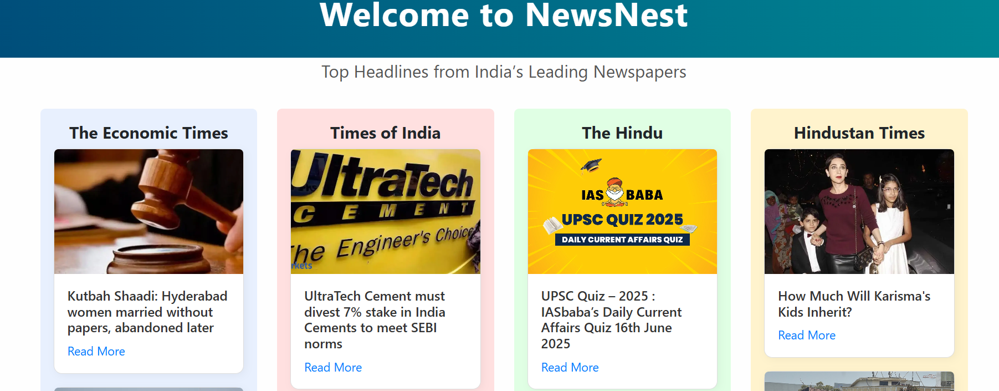
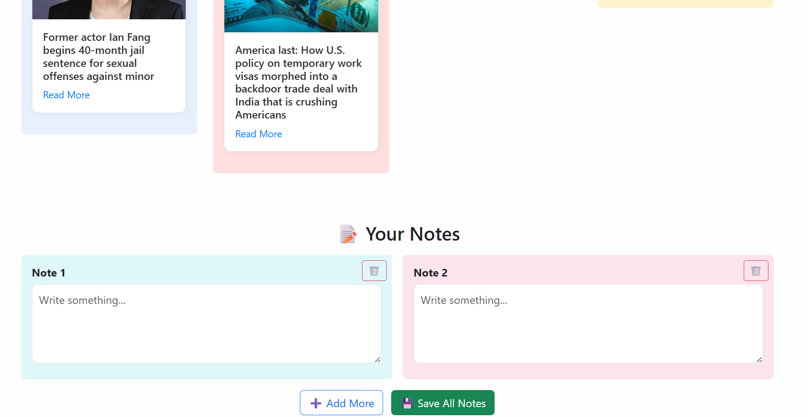

  

# 📰 NewsNest — Your Daily News, Beautifully Organized

**NewsNest** is a modern, responsive Flask web app that fetches and displays daily headlines from top Indian newspapers like:

- 🟣 The Economic Times
- 🔵 Times of India
- 🟠 The Hindu
- 🔴 Hindustan Times

With a colorful, column-based layout and integrated note-taking section, this app helps you read, organize, and even save personal notes — all in one place.

---

## 🔍 Features

✅ Fetches real-time news using [NewsAPI.org](https://newsapi.org/)  
✅ Beautiful 4-column layout per newspaper  
✅ Each headline includes a thumbnail image  
✅ Tap to read full articles in a new tab  
✅ 📒 Notes Section — write and save custom notes  
✅ 💾 Export notes as a `.txt` file  
✅ 🗑️ Delete notes instantly  
✅ Responsive UI with unique color-coded sections

---

## 📸 Screenshot

---